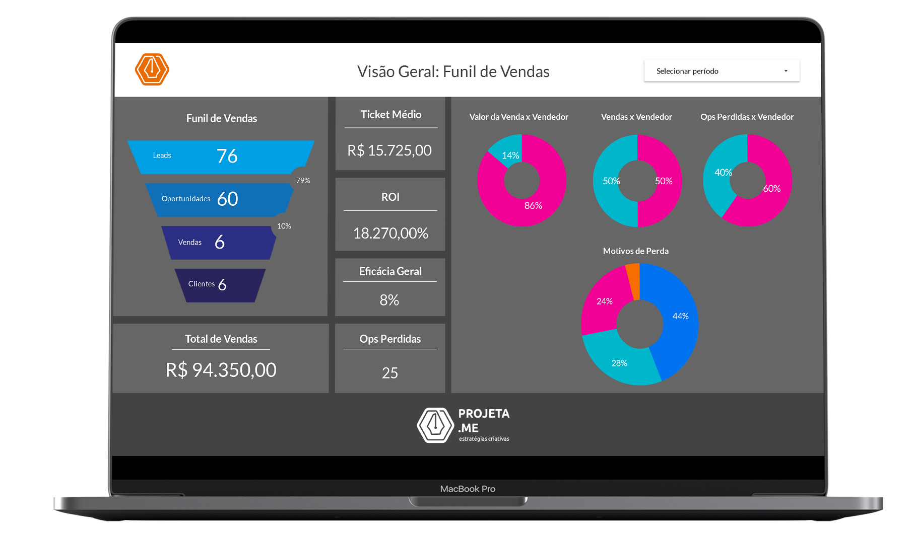
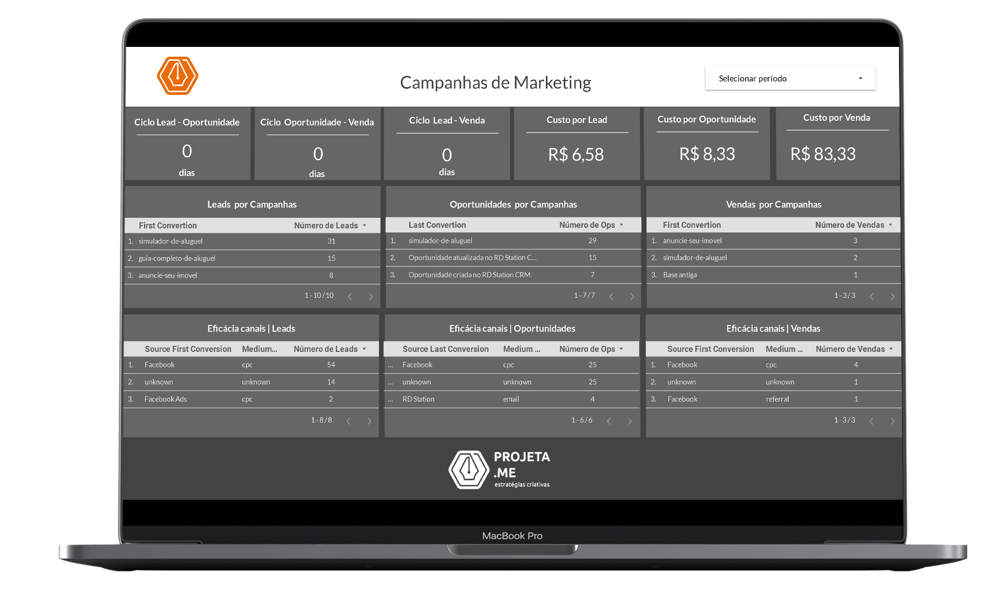

<h1>Designing a integrnated RD Station Marketing Dashboard</h1>

<h2>The main problem</h2>

bla bla bla

<h2>The solution designed</h2>

From the knowledge of the client's pain, the metrics that the client would like to be added to the BI tool were raised.

Based on the requested metrics, the necessary data were collected to build them.

The data was extracted from RD Station using an integration API using Google Apps Script.

The data is extracted from RD Station and sent to Google Sheets via API. The data stored in Google Sheets feeds a Dashboard built in Google Data Studio.

The project architecture can be viewed below:

IMAGENS

RD Station sends data in the form of a Webhook and can also be sent via an integration url.

Thus, to extract data from the platform, 3 webhooks were created, namely:

-Leads: In this webhook, landing pages responsible for converting new leads were added;

-Opportunities: In this webhook, landing pages responsible for converting new opportunities were added;

-Sales: Each Opportunity marked as Sale in RD Station CRM, generates a conversion event in RD Station Marketing.

And an automation flow to capture missed opportunities. Opportunities marked as lost in RD Station CRM, generate a conversion event in RD Station Marketing, so these Missed Opportunities enter the automation flow created and are sent via the integration url to Google Sheets.

RD Station sends data in standard JSON, like this for example:

{
 "leads": [
 {
 "id": "390319847",
 "email": "teste@webhook.com",
 "name": "Fulano Suporte RD",
 "company": null,
 "job_title": "Analista",
 "bio": null,
 "public_url": "http:\/\/rdstation.com.br\/leads\/public\/807029c7-267f-4225-8428-87ae2dab34c3",
 "created_at": "2018-09-26T17:57:10.189-03:00",
 "opportunity": "true",
 "number_conversions": "1",
 ...
 }] 
}

The integration API is responsible for requesting data from the RD, and separating the fields (parse process). The RD sends all available data, but it is possible to choose which one we want to save in our spreadsheet.
RD Station has standard fields and custom fields, which differ according to the business.
The API for the Leads webhook is shown below

// Função que recebe os dados do webhook do RD Station e insere dados na planilha
function doPost(e) {
  // Acessa planilha e aba para inserir dados
  var spreadsheet = SpreadsheetApp.openById('ID');
  // O identificar da planilha está em sua URL
  // Para mais informações acesse: https://developers.google.com/apps-script/reference/spreadsheet/spreadsheet-app#openbyidid
  var sheet = spreadsheet.getSheetByName('Leads');
  
  // Acessa os dados enviados pelo webhook do RD Station   
  var requestData = JSON.parse(e.postData.contents);
  var leadData = requestData.leads;
  
  // Cria uma trava que impede que dois ou mais usuários executem o script simultaneamente
  var trava = LockService.getScriptLock();
  trava.waitLock(2000);
  
  //
  var values = []
  var timestamp = new Date();
  var JSONSource = JSON.stringify(requestData);
  
  //Extrai dados do lead para inserção
  for (var i = 0; i < leadData.length; i++) {
    values.push([JSONSource,
                 timestamp,
                 leadData[i].id,
                 leadData[i].first_conversion.content.identificador,
                 leadData[i].first_conversion.conversion_origin.source,
                 leadData[i].first_conversion.conversion_origin.medium,
                 leadData[i].custom_fields["Como podemos te ajudar?"],
                 leadData[i].custom_fields["Prefiro contato via:"],
                 leadData[i].custom_fields["Qual seu plano do RD Station?"],
                 leadData[i].custom_fields["Utiliza RD Station CRM?"]]);
  }
  
  // Atualiza a planilha com a nova linha  
  sheet.getRange(sheet.getLastRow()+1, 1, values.length, values[0].length).setValues(values);
  SpreadsheetApp.flush();
  
    
  // Desativa a trava do script para que possa receber outras mensagens do webhook
  trava.releaseLock();
  return "OK";
}

function doGet(request) {
  return HtmlService.createHtmlOutput("<h2>Get request recebida.</h2>
Essa função te ajuda a identificar se o Web App da integração está ativo.
");
}

After deploying the API, and adding the url to the respective webhook, the application was up and running, populating the spreadsheet

With the first part of the project completed, the stage of building a dashboard started using Google DataStudio.

Data Studio is an open source tool, it has a diversity of tools. It is possible to use several data sources, including:

Pode-se combinar fontes de dados 

Filtros 

And a dashboard with a sensational look with relevant information that generates value.

The final result of the Dashboard, you can check now.

The project consists of three screens:

The first one is to have an overview of the sales base and funnel

The second is to evaluate marketing campaigns

The third is to understand the segmentation and interest of the leads

This is an operational dashboard, presents metrics present and is ideal to assess in real time the behavior of the lead base, sales, campaigns, performance of the commercial and marketing teams.

From it, it is possible to view the data presented quite clearly and can be used to gain insights into the company's current strategy.

Criar campos calculados

<h3>This is heading 3</h3>

